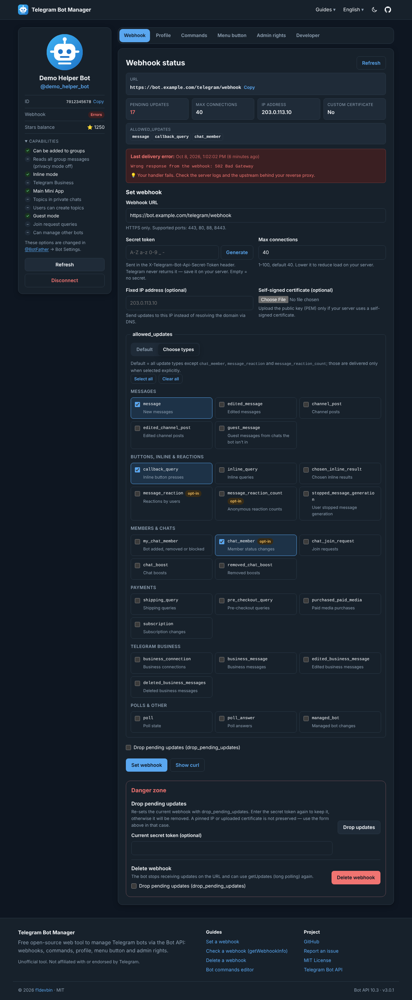
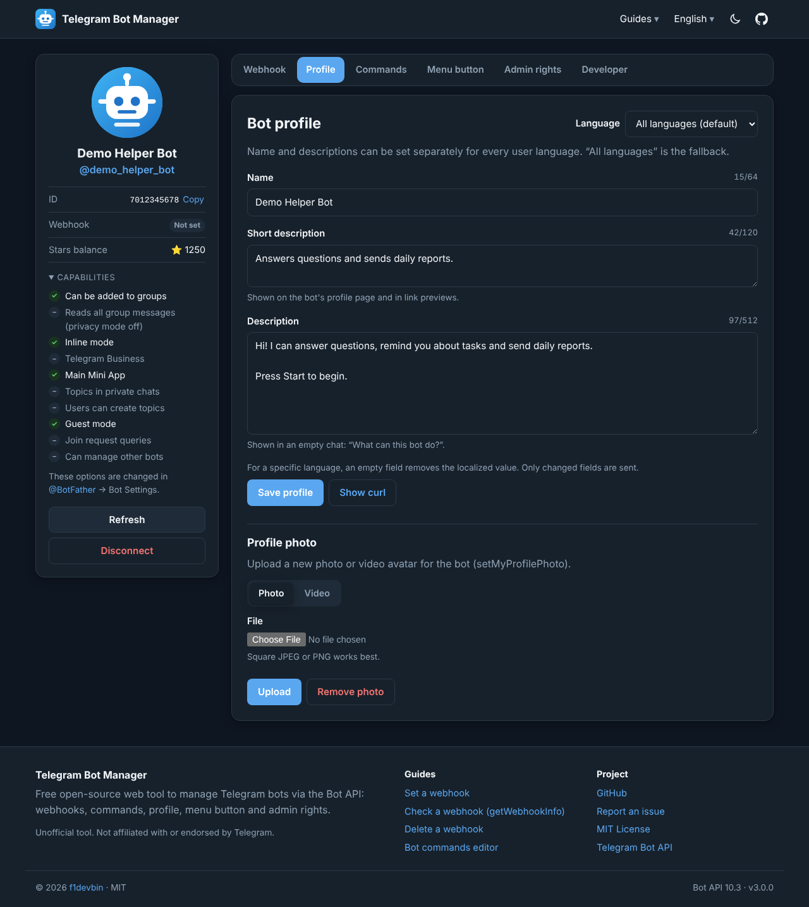
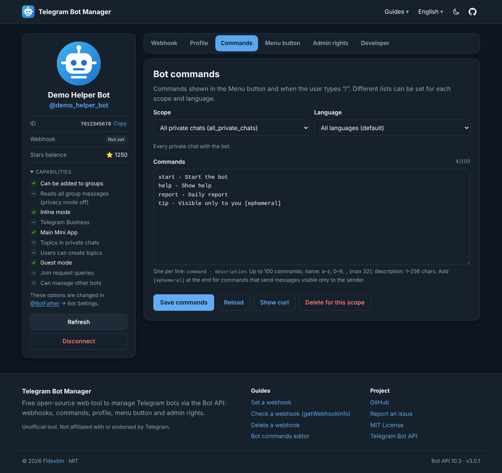
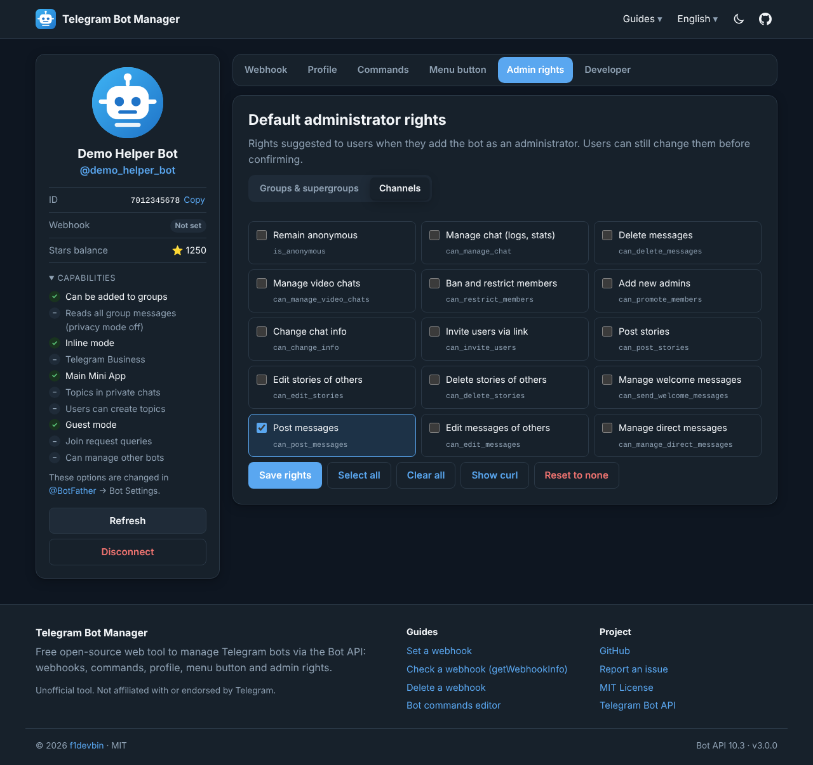
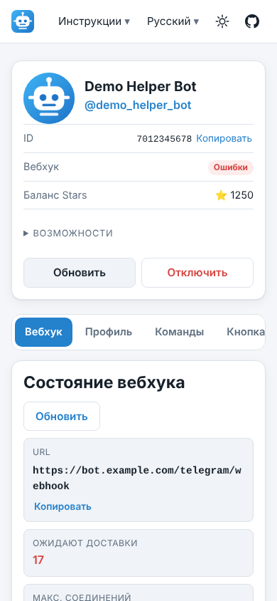

# Telegram Bot Manager — online webhook & bot settings tool

[](https://f1devbin.github.io/telegram-bot-manager/)
[](https://core.telegram.org/bots/api)
[](https://github.com/f1devbin/telegram-bot-manager/actions/workflows/pages.yml)
[](LICENSE)

**[Open Telegram Bot Manager →](https://f1devbin.github.io/telegram-bot-manager/)**

A free, open-source web tool to manage a Telegram bot through the Bot API: **set, check (getWebhookInfo) and delete webhooks**, edit **commands**, **name, description and avatar**, the **menu button** and **default admin rights**. No code, no install, no backend: it runs entirely in your browser.

🇬🇧 English · [🇷🇺 Русский](README.ru.md) · the site itself is available in English, Русский, Español, Português and 简体中文.



## Features

- **Webhook manager**: `setWebhook` with `secret_token` (built-in generator), `allowed_updates`, `max_connections`, fixed `ip_address` and self-signed `certificate` upload. Delete the webhook or drop pending updates without losing your secret token.
- **getWebhookInfo checker**: URL, pending updates, last delivery error and sync errors in your local time, with hints for SSL, DNS, timeout, 3xx/4xx/5xx errors.
- **Commands editor**: `setMyCommands` / `deleteMyCommands` as plain text with validation, for every scope (`default`, `all_private_chats`, `all_group_chats`, `all_chat_administrators`, `chat`, `chat_administrators`, `chat_member`), every `language_code`, and `is_ephemeral`.
- **Profile**: `setMyName`, `setMyDescription`, `setMyShortDescription` per language. Only changed fields are sent, and rate limits (`429 retry_after`) are shown clearly.
- **Avatar**: `setMyProfilePhoto` (photo or video) and `removeMyProfilePhoto`.
- **Menu button**: `setChatMenuButton` for commands, Web App (Mini App) or default, globally or per chat.
- **Admin rights**: `setMyDefaultAdministratorRights` for groups **and** channels, including `can_manage_direct_messages`, `can_manage_tags` and `can_send_welcome_messages`.
- **Bot info**: every `getMe` capability flag (guest mode, topics, business, Mini App…) and the Telegram Stars balance.
- **Developer tools**: raw JSON responses, a request log and a ready-to-copy `curl` command for every action. The token and secret are replaced with `$BOT_TOKEN` / `$WEBHOOK_SECRET`.
- 5 languages, light and dark themes, works on mobile, accessible keyboard navigation.

| Profile | Commands | Admin rights | Mobile |
| :---: | :---: | :---: | :---: |
|  |  |  |  |

## Privacy and security

- The site is static (GitHub Pages). There is **no server** that could store or log your token.
- Requests go from your browser directly to `https://api.telegram.org`, or to an API server you choose.
- By default the token is kept only in the current tab (`sessionStorage`). “Remember on this device” uses `localStorage`; **Disconnect** clears both.
- The bot avatar is loaded straight from the Bot API server with `referrerpolicy="no-referrer"`; through a CORS proxy it is downloaded as a blob instead.
- Strict Content Security Policy, no analytics, no third-party scripts or fonts.

If a token leaks, revoke it with [@BotFather](https://t.me/BotFather) → `/revoke`.

## CORS proxy

Some networks, countries or browser extensions block `api.telegram.org`. In that case deploy the bundled [Cloudflare Worker](proxy/cloudflare-worker.js) (the free plan is enough):

1. Cloudflare dashboard → **Workers & Pages** → **Create** → **Worker** → paste `proxy/cloudflare-worker.js` → **Deploy**.
2. Optional: set the `ALLOWED_ORIGIN` variable to your site origin (default `https://f1devbin.github.io`).
3. In Telegram Bot Manager open **Advanced: API server** and enter the worker URL.

A [local Bot API server](https://github.com/tdlib/telegram-bot-api) (`http://localhost:8081`) works the same way.

## Self-hosting

**GitHub Pages:** fork the repository → **Settings → Pages → Source: GitHub Actions**. Every push to `main` runs the tests and deploys the site. For a custom domain, set the repository variable `SITE_URL` (for example `https://bots.example.com/`) so canonical links and the sitemap use it.

**Any static hosting:**

```bash
npm run build      # generates dist/
npm run serve      # preview at http://localhost:8080
```

Node.js 20+ is required. The project has no npm dependencies.

## Development

```
src/
  templates/   layout.html, index.html (app + landing), guide.html
  i18n/        en.json, ru.json, es.json, pt.json, zh.json
  assets/js/   ES modules: api, validators, commands, curl, i18n, ui, tabs/*
  assets/css/  app.css (light/dark design tokens)
  static/      files copied to the site root as-is (e.g. a Google Search Console verification file)
scripts/
  build.mjs        static site generator: 5 languages × 5 pages, hreflang, sitemap, JSON-LD
  serve.mjs        local preview server
  screenshots.mjs  end-to-end test with a mocked Bot API + README screenshots (needs Playwright)
  images.mjs       icons and Open Graph images (needs Playwright)
proxy/             optional Cloudflare Worker CORS proxy
tests/             node:test unit tests
```

```bash
npm test                          # unit tests, locale consistency, build check
npm run build && node scripts/screenshots.mjs   # e2e smoke test (Playwright + Chromium)
```

**Adding a language:** copy `src/i18n/en.json` to `<code>.json`, translate it, and add the language to `LANGS` in `scripts/build.mjs`. The tests fail if any key is missing.

**New Bot API version:** update `src/assets/js/data.js` (update types, admin rights, `getMe` flags) and the translations; `npm test` lists every missing label.

## FAQ

**How do I check my bot's webhook?** Connect the bot and open the Webhook tab: it calls `getWebhookInfo` and explains the last error.

**How do I fix “409 Conflict: can't use getUpdates method while webhook is active”?** Delete the webhook (Webhook → Danger zone → Delete webhook), then use `getUpdates`.

**Why don't I receive `chat_member` or reaction updates?** They are excluded by default. Choose them explicitly in `allowed_updates`.

More in the guides: [set a webhook](https://f1devbin.github.io/telegram-bot-manager/set-webhook/) · [check a webhook](https://f1devbin.github.io/telegram-bot-manager/webhook-info/) · [delete a webhook](https://f1devbin.github.io/telegram-bot-manager/delete-webhook/) · [bot commands](https://f1devbin.github.io/telegram-bot-manager/bot-commands/).

## Contributing

Issues and pull requests are welcome. Please run `npm test` before submitting.

## License

[MIT](LICENSE) © 2026 f1devbin.

Unofficial tool. Not affiliated with or endorsed by Telegram.
